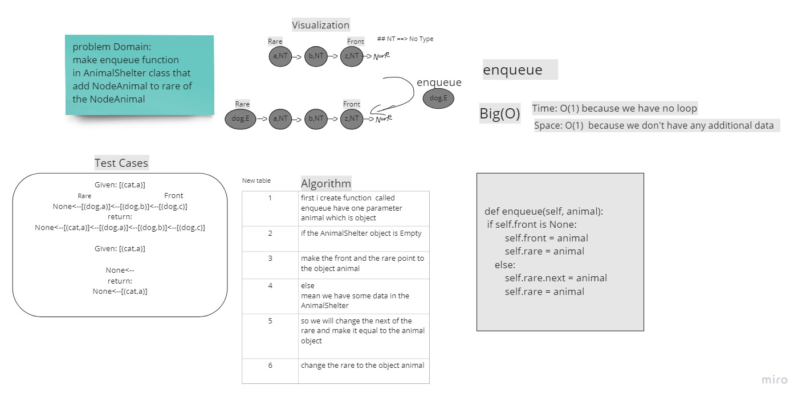

# Challenge Summary
<!-- Description of the challenge -->
you have a AnimalShelter class follow the FIFO like queue and it will enqueue and dequeue  a dog or cat  
and you have handle priority for each of them

## Whiteboard Process
<!-- Embedded whiteboard image -->


## Approach & Efficiency
<!-- What approach did you take? Why? What is the Big O space/time for this approach? -->
enqueue: O(n) 
Space O(1) there is no adding in the space
Time O(1) no loop just add to the front 

## Solution
<!-- Show how to run your code, and examples of it in action -->

```
    def enqueue(self, animal):
        if self.front is None:
            self.front = animal
            self.rare = animal
        else:
            self.rare.next = animal
            self.rare = animal
```