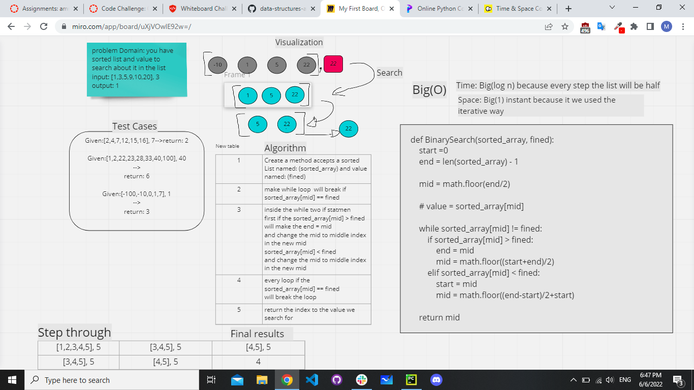

# array-binary-search

## Binary Search of Sorted Array
search in sorted array using binary search  to get  less complexty and return the index to the value you choos

```
def BinarySearch(sorted_array, fined):
    start =0
    end = len(sorted_array) - 1
    
    mid = math.floor(end/2)
    
    # value = sorted_array[mid]
    
    while sorted_array[mid] != fined:
        if sorted_array[mid] > fined:
            end = mid
            mid = math.floor((start+end)/2)
        elif sorted_array[mid] < fined:
            start = mid
            mid = math.floor((end-start)/2+start)
    
    return mid
```

## Whiteboard Process


## Approach & Efficiency
the binary search to get less complexty

Time: Big(log n) because every step the list will be half

Space: Big(1) instant because it we used the iterative way
