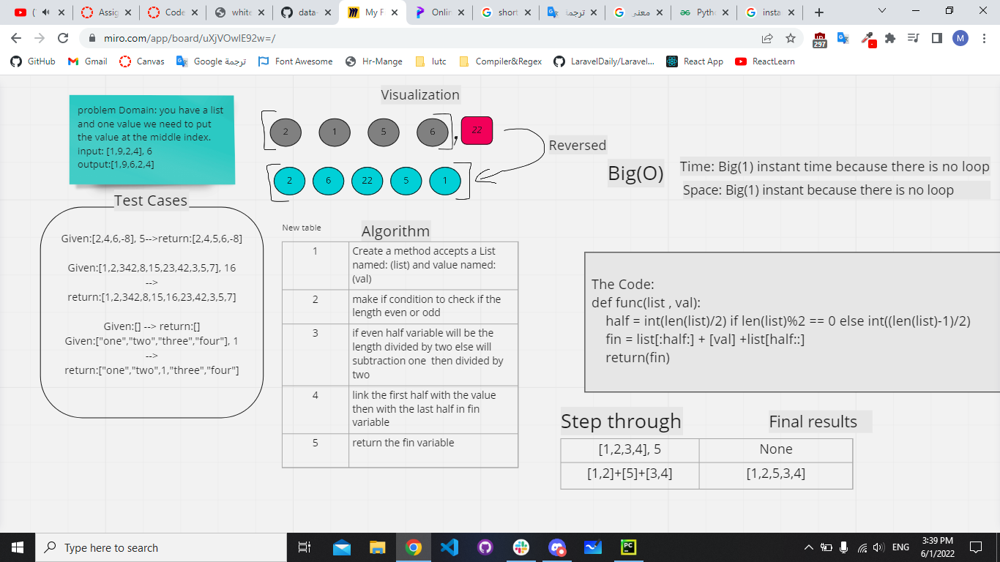

# Insert to Middle of an Array

in this challenge you will receve a list and value and you need to put 

```
def func(list , val):
    half = int(len(list)/2) if len(list)%2 == 0 else int((len(list)-1)/2)
    fin = list[:half:] + [val] +list[half::]
    return(fin)
```

## Whiteboard Process

[]()


## Approach & Efficiency
What approach did you take? 

less complexty no loop

and shrink the code as possible i can

Discuss Why. What is the Big O space/time for this approach?

Time -> Big(1) instant time because there is no loop or any thing will increase the complexity

Space -> Big(1) instant space because there is no loop or any thing will increase the space complexity
