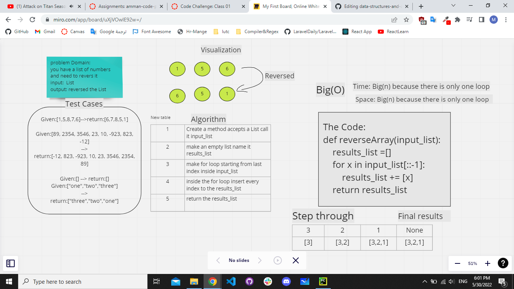

# Reverse an Array
 Description of the challenge
 
Making a function that resive a list and return the revers of it

```
def reverseArray(input_list):
    results_list =[]
    for x in input_list[::-1]:
        results_list += [x]
    return results_list
```
## Whiteboard Process


## Approach & Efficiency
What approach did you take? 

As few lines as possible 

Discuss Why?

To make it readable and easy to understand

What is the Big O space/time for this approach?

for Time --> Big(n)

for Spase --> Big(n)
