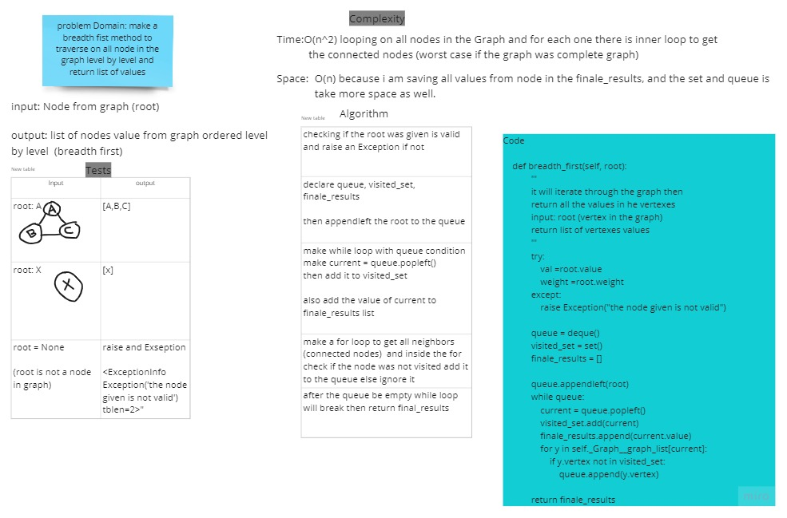

# Challenge Summary
<!-- Description of the challenge -->
 i have a graph and i should make a method take Node from the graph and i should return list of values from the graph by following breadth first approach


## Whiteboard Process
<!-- Embedded whiteboard image -->


## Approach & Efficiency
<!-- What approach did you take? Why? What is the Big O space/time for this approach? -->
following to breadth first traversal rules will have a list of all node values was add to the list level by level like how breadth first woks

Time:O(n^2) looping on all nodes in the Graph and for each one there is inner loop to get the connected nodes (worst case if the graph was complete graph)
Space: O(n) because i am saving all values from node in the finale_results, and the set and queue is take more space as well.


## Solution

```
class Graph_breadth_first(Graph):

    def breadth_first(self, root):
            '''
            it will iterate through the graph then 
            return all the values in he vertexes
            input: root (vertex in the graph)
            return list of vertexes values
            '''
            try:
                val =root.value
                weight =root.weight
            except:
                raise Exception("the node given is not valid")
 

            queue = deque()
            visited_set = set()
            finale_results = []

            queue.appendleft(root)
            while queue:
                current = queue.popleft()
                visited_set.add(current)
                finale_results.append(current.value)
                for y in self._Graph__graph_list[current]:
                    if y.vertex not in visited_set:
                        queue.append(y.vertex)

            return finale_results
```
