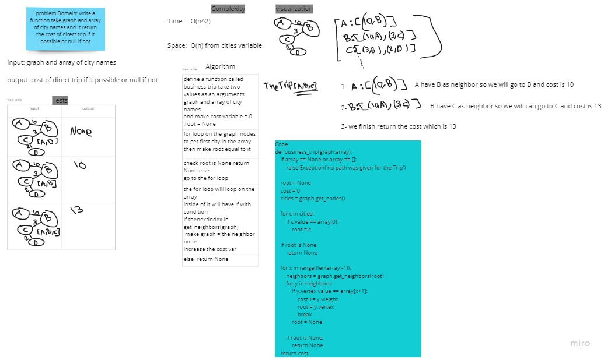

# Challenge Summary
<!-- Description of the challenge -->
write a function take graph and array of city names and it return the cost of direct trip if it possible or null if not

## Whiteboard Process
<!-- Embedded whiteboard image -->



## Approach & Efficiency
<!-- What approach did you take? Why? What is the Big O space/time for this approach? -->
getting the starting point using get_nodes method then start checking if the next trip in the neighbors or not

Time : O(n^2) when graph is complex 

space : O(n)

## Solution
<!-- Show how to run your code, and examples of it in action -->

```
def business_trip(graph,array):

    if array == None or array == []:
        raise Exception('no path was given for the Trip')
        
    root = None
    cost = 0
    cities = graph.get_nodes()

    for c in cities:
        if c.value == array[0]:
            root = c

    if root is None:
        return None
        
    for x in range((len(array)-1)):
        neighbors = graph.get_neighbors(root)
        for y in neighbors:
            if y.vertex.value == array[x+1]:
                cost += y.weight
                root = y.vertex
                break
            root = None
        
        if root is None:
            return None
    return cost
```