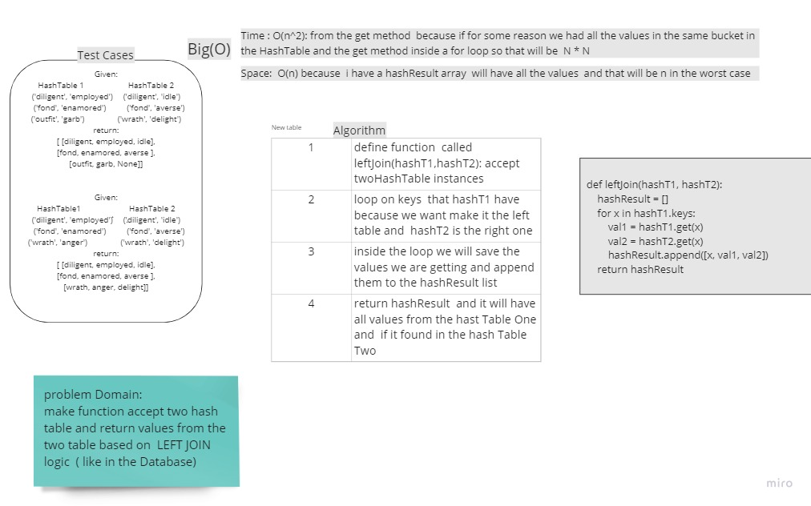

# Hashmap LEFT JOIN
<!-- Short summary or background information -->

The LEFT JOIN keyword returns all records from the left table (table1), and the matching records from the right table (table2).

The result is None or Null or 0 records from the right side, if there is no match.

## Challenge
<!-- Description of the challenge -->

make function accept two hash table and return values from the two table based on  LEFT JOIN  logic  ( like in the Database)

## Approach & Efficiency
<!-- What approach did you take? Why? What is the Big O space/time for this approach? -->

following the  LEFT JOIN logic i used two hash table instances from HashTable class and make a left join on the first one (one is the left and Two is the right)

and the hashmap data structure will help me to get less time complexity on the average and best case

Time : O(n^2): from the get method  because if for some reason we had all the values in the same bucket in the HashTable and the get method inside a for loop so that will be  N * N

Space:  O(n) because  i have a hashResult array  will have all the values  and that will be n in the worst case

## Solution
<!-- Embedded whiteboard image -->

