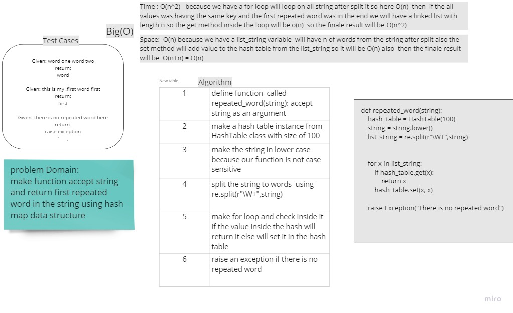

# Challenge Summary
<!-- Description of the challenge -->
make function accept string  and return first repeated word in the string using hash map data structure


## Whiteboard Process
<!-- Embedded whiteboard image -->



## Approach & Efficiency
<!-- What approach did you take? Why? What is the Big O space/time for this approach? -->
i used the hash map data structure in my function to make less time complexity on the best and average case 

Time : O(n^2)   because we have a for loop will loop on all string after split it so here O(n)  then  if the all values was having the same key and the first repeated word was in the end we will have a linked list with length n so the get method inside the loop will be o(n)  so the finale result will be O(n^2)

Space:  O(n) because we have a list_string variable  will have n of words from the string after split also the set method will add value to the hash table from the list_string so it will be O(n) also  then the finale result will be  O(n+n) = O(n)

## Solution
<!-- Show how to run your code, and examples of it in action -->
```
def repeated_word(string):
    hash_table = HashTable(100)
    string = string.lower()
    list_string = re.split(r"\W+",string)

    
    for x in list_string:
        if hash_table.get(x):
            return x
        hash_table.set(x, x)

    raise Exception("There is no repeated word")

```