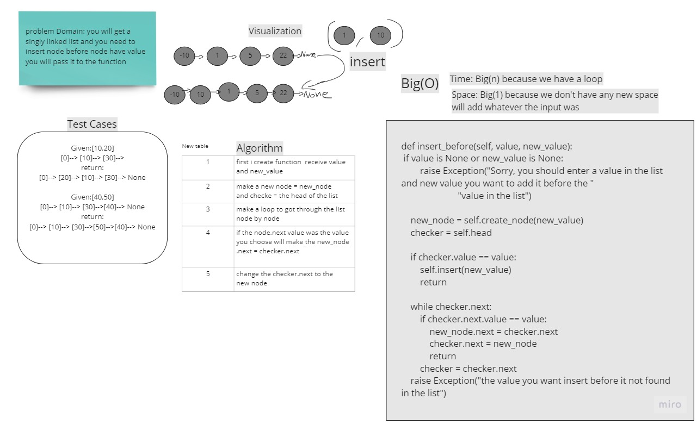

# Challenge Summary
<!-- Description of the challenge -->

The Challenge requirements is basic create a Singly linked list 

and node class to create node that will be added to the list 

then you should have append method to let you add node to the end of the list also you should have an insert_before method
that will insert node before a node value you choose  last method is insert_after will insert node after a node value you choose


## Whiteboard Process



## Approach & Efficiency
 Single-responsibility principle 

## Solution
<!-- Show how to run your code, and examples of it in action -->

```
one = Linked_list()
    one.insert(10)
    one.insert(20)
    one.insert(30)

    one.insert_before(30, 22)
    print(one.to_string())

output  ==>  30 --> 22 --> 20 --> 10
```
