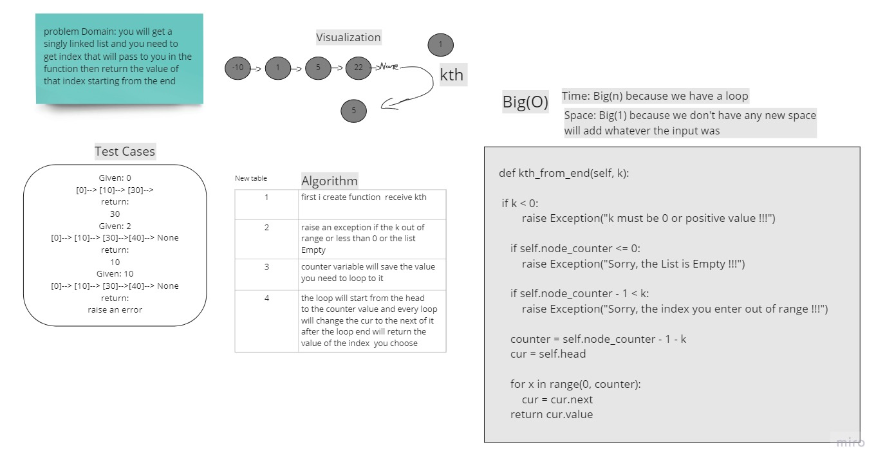

# Challenge Summary

the challenge need a method that you can pass kth integer to it then it will

return the value of the index that inside of the lest index counter start 

from the end of the list 

## Whiteboard Process
<!-- Embedded whiteboard image -->

## Approach & Efficiency
i made counter that count the nodes the with for loop and calculate the right value from the k 

will stop on the value i want it and the return it 

Time complexity is  O(n)

Spase complexity is O(1)

## Solution
<!-- Show how to run your code, and examples of it in action -->
```
    def kth_from_end(self, k): # pass the index you want
```
        if k < 0:# rais an Exception if the k is less than 0
            raise Exception("k must be 0 or positive value !!!") 
```

        if self.node_counter <= 0: # rais an Exception if the list Empty 
            raise Exception("Sorry, the List is Empty !!!")
```
        if self.node_counter - 1 < k: # rais an Exception if the k is more than last index in the list 
            raise Exception("Sorry, the index you enter out of range !!!")
```
        counter = self.node_counter - 1 - k # counter to get the right index in for loop
        cur = self.head
```
        for x in range(0, counter):
            cur = cur.next # change the cur value every loop to the next node
        return cur.value #return the value in the index have the same number of the k you pass it 
