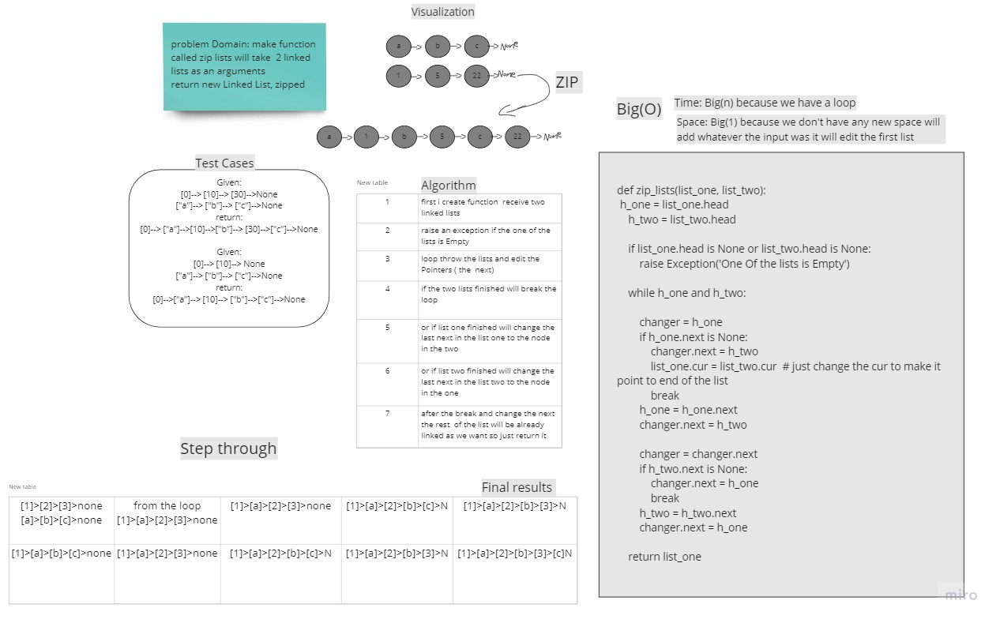

# Challenge Summary
make function  called zip lists will take  2 linked lists as an arguments

return new Linked List, zipped 

## Whiteboard Process
<!-- Embedded whiteboard image -->

## Approach & Efficiency
What approach did you take? 
less complexity and simple readable code

What is the Big O space/time for this approach?

time: O(n) witch n is the shortest linked list

space: O(1) no space was added


## Solution

```

def zip_lists(list_one, list_two):
    h_one = list_one.head
    h_two = list_two.head

    if list_one.head is None or list_two.head is None:
        raise Exception('One Of the lists is Empty')

    while h_one and h_two:

        changer = h_one
        if h_one.next is None:
            changer.next = h_two
            list_one.cur = list_two.cur  # just change the cur to make it point to end of the list
            break
        h_one = h_one.next
        changer.next = h_two

        changer = changer.next
        if h_two.next is None:
            changer.next = h_one
            break
        h_two = h_two.next
        changer.next = h_one

    return list_one


```