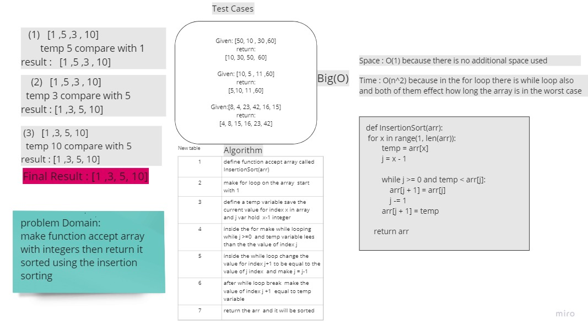
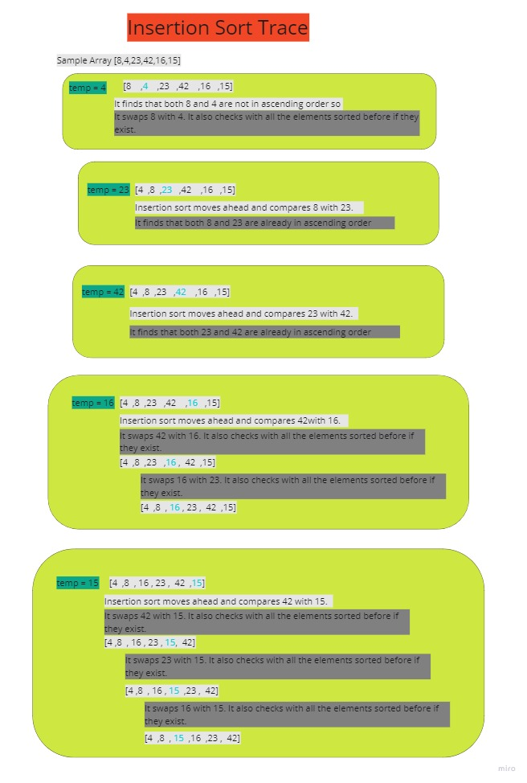

# Challenge Summary
<!-- Description of the challenge -->
make function accept array with integers then return it sorted using the insertion sorting

## Whiteboard Process
<!-- Embedded whiteboard image -->


## Approach & Efficiency
<!-- What approach did you take? Why? What is the Big O space/time for this approach? -->
following the insertion sort to sort the array

Space : O(1) because there is no additional space used

Time : O(n^2) because in the for loop there is while loop also
and both of them effect how long the array is in the worst case

## Solution
<!-- Show how to run your code, and examples of it in action -->
```
def InsertionSort(arr):
 for x in range(1, len(arr)):
        temp = arr[x]
        j = x - 1

        while j >= 0 and temp < arr[j]:
            arr[j + 1] = arr[j]
            j -= 1
        arr[j + 1] = temp

    return arr

```