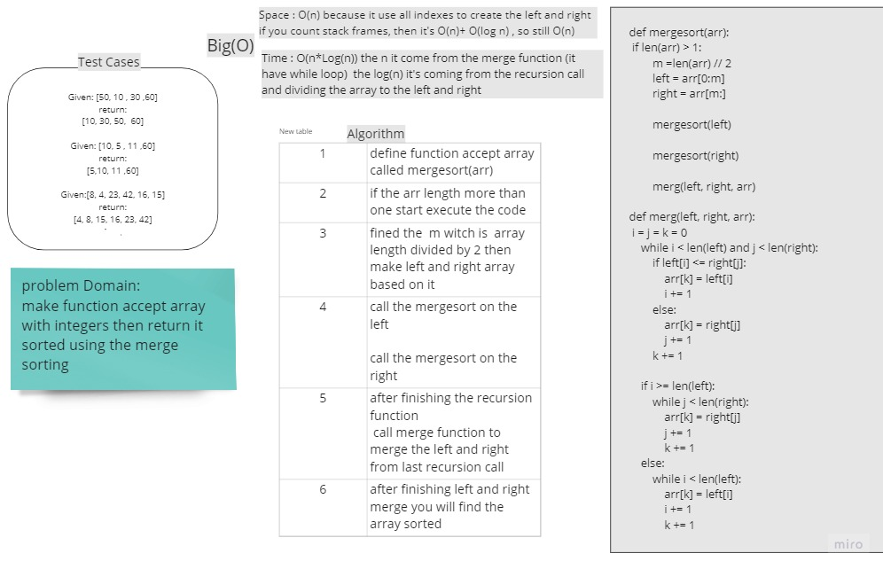
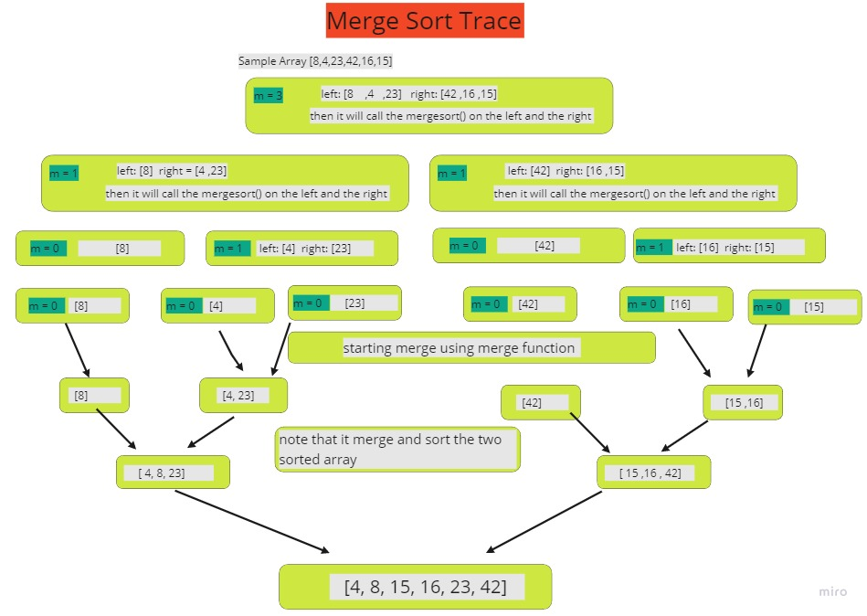

# Challenge Summary
<!-- Description of the challenge -->
make function accept array with integers then return it sorted using the merge sorting algorithm

## Whiteboard Process
<!-- Embedded whiteboard image -->



## Approach & Efficiency
<!-- What approach did you take? Why? What is the Big O space/time for this approach? -->
following the merge sort algorithm to sort the array


Space : O(n) because it use all indexes to create the left and right
if you count stack frames, then it's O(n)+ O(log n) , so still O(n)

Time : O(n*Log(n)) the n it come from the merge function (it have while loop)  the log(n) it's coming from the recursion call and dividing the array to the left and right

## Solution
<!-- Show how to run your code, and examples of it in action -->

### Merge Sort Function
```
def mergesort(arr):
    if len(arr) > 1:
        m =len(arr) // 2
        left = arr[0:m]
        right = arr[m:]

        mergesort(left)

        mergesort(right)

        merg(left, right, arr)
        
```
### Merge Function
```
def merg(left, right, arr):
    i = j = k = 0
    while i < len(left) and j < len(right):
        if left[i] <= right[j]:
            arr[k] = left[i]
            i += 1
        else:
            arr[k] = right[j]
            j += 1
        k += 1

    if i >= len(left):
        while j < len(right):
            arr[k] = right[j]
            j += 1
            k += 1
    else:
        while i < len(left):
            arr[k] = left[i]
            i += 1
            k += 1

```
