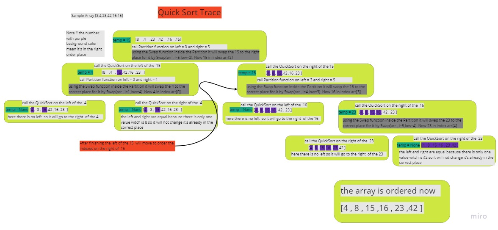
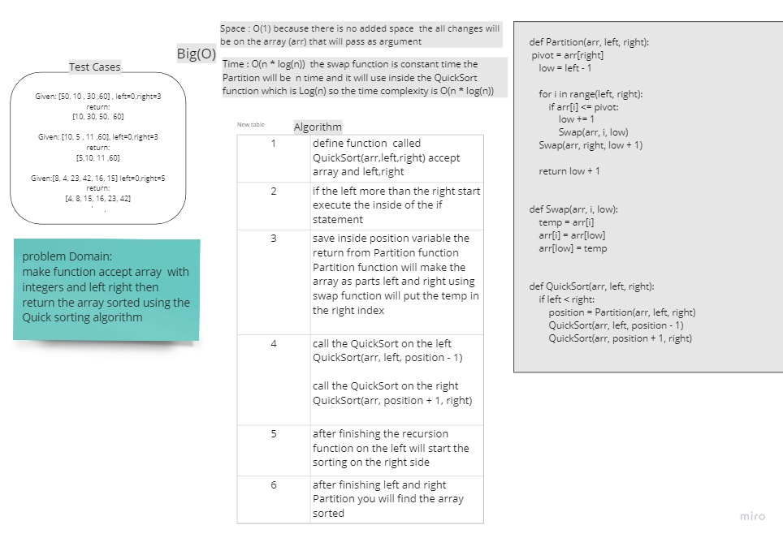
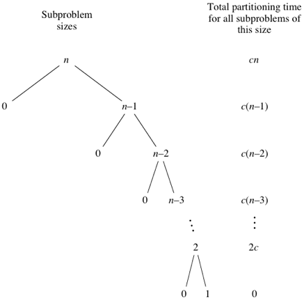

# Challenge Summary
<!-- Description of the challenge -->
make function accept array and left, right  all integers then return the array sorted using the Quick sorting algorithm

## Whiteboard Process
<!-- Embedded whiteboard image -->


## Approach & Efficiency
<!-- What approach did you take? Why? What is the Big O space/time for this approach? -->
following the  Quick sorting to sort the array with less Time complexity and also less space complexity (not on all cases)

Time : O(n^2)   When quicksort always has the most unbalanced partitions possible  (( after the first partition, one array will have 1 element and the other one will have (N-1) elements.  ))


Space:  O(n) because my recursion will be called on all the indexes in the array  if it was  always has the most unbalanced partitions possible (call stack will have  n number of node)

 ### this image will show you tree with most unbalanced partitions possible




## Solution
<!-- Show how to run your code, and examples of it in action -->

```
def Partition(arr, left, right):
    pivot = arr[right]
    low = left - 1

    for i in range(left, right):
        if arr[i] <= pivot:
            low += 1
            Swap(arr, i, low)
    Swap(arr, right, low + 1)

    return low + 1


def Swap(arr, i, low):
    temp = arr[i]
    arr[i] = arr[low]
    arr[low] = temp


def QuickSort(arr, left, right):
    if left < right:
        position = Partition(arr, left, right)
        QuickSort(arr, left, position - 1)
        QuickSort(arr, position + 1, right)
        return arr
```
