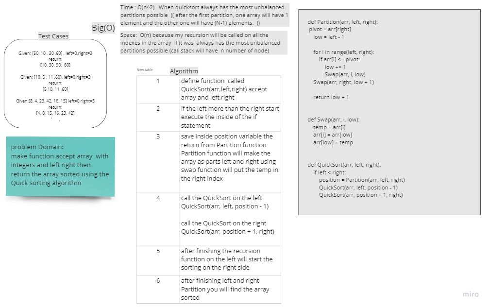

# Challenge Summary
<!-- Description of the challenge -->
make function accept array and left, right  all integers then return the array sorted using the Quick sorting algorithm

## Whiteboard Process
<!-- Embedded whiteboard image -->


## Approach & Efficiency
<!-- What approach did you take? Why? What is the Big O space/time for this approach? -->
following the  Quick sorting to sort the array with less Time complexity and also less space complexity 

Space : O(1) because there is no added space  the all changes will be on the array (arr) that will pass as argument

Time : O(n * log(n))  the swap function is constant time the Partition will be  n time and it will use inside the QuickSort function which is Log(n) so the time complexity is O(n * log(n))

## Solution
<!-- Show how to run your code, and examples of it in action -->

```
def Partition(arr, left, right):
    pivot = arr[right]
    low = left - 1

    for i in range(left, right):
        if arr[i] <= pivot:
            low += 1
            Swap(arr, i, low)
    Swap(arr, right, low + 1)

    return low + 1


def Swap(arr, i, low):
    temp = arr[i]
    arr[i] = arr[low]
    arr[low] = temp


def QuickSort(arr, left, right):
    if left < right:
        position = Partition(arr, left, right)
        QuickSort(arr, left, position - 1)
        QuickSort(arr, position + 1, right)
        return arr
```
