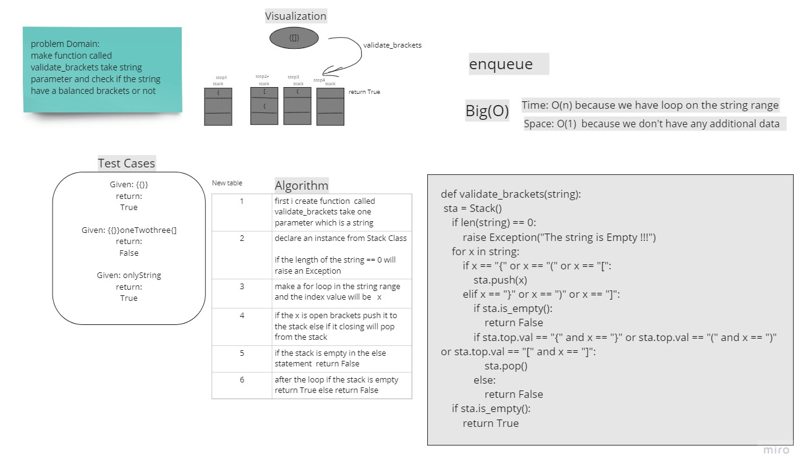

# Challenge Summary
<!-- Description of the challenge -->
we have to make function take one argument (String) and return Boolean
to check if the brackets in the string  are balanced if it balanced return True else False

## Whiteboard Process
<!-- Embedded whiteboard image -->


## Approach & Efficiency
<!-- What approach did you take? Why? What is the Big O space/time for this approach? -->
using Stack Datastructure it will push to the top every open bracket and if it closing  bracket it will pop from it 


## Solution
<!-- Show how to run your code, and examples of it in action -->
```
def validate_brackets(string):
    sta = Stack()
    if len(string) == 0:
        raise Exception("The string is Empty !!!")
    for x in string:
        if x == "{" or x == "(" or x == "[":
            sta.push(x)
        elif x == "}" or x == ")" or x == "]":
            if sta.is_empty():
                return False
            if sta.top.val == "{" and x == "}" or sta.top.val == "(" and x == ")" or sta.top.val == "[" and x == "]":
                sta.pop()
            else:
                return False
    if sta.is_empty():
        return True
    else:
        return False
```