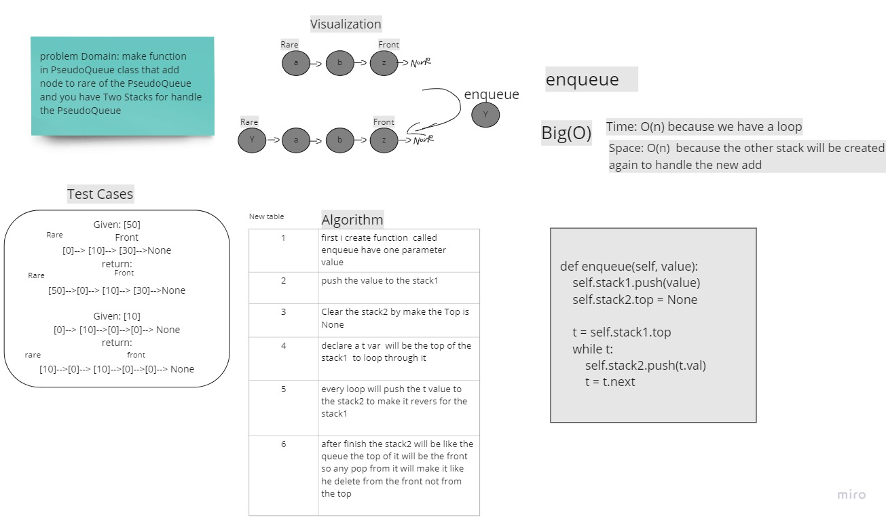

# Challenge Summary
<!-- Description of the challenge -->
Implement a Queue using two Stacks.

using two Stacks create a queue with two method  

- enqueue
    - take a value as an arguments 
    - insert it to the end of the Queue


- dequeue
    - No artuments
    - Delete the Front node from the Queue

## Whiteboard Process
<!-- Embedded whiteboard image -->



## Approach & Efficiency
<!-- What approach did you take? Why? What is the Big O space/time for this approach? -->

i have two Stacks to create the Queue  so i used one  to take the data and the other will be the one will print the values

as a queue because the stack follow the FILO  and the Queue  follow the FIFO

- enqueue
    - Space O(n) because the other stack will be created again to handle the new add
    - Time  O(n)  because the While Loop


- dequeue
    - Space O(n) because the other stack2 will be created again to handle the new add
    - Time  O(n)  because the While Loop

## Solution
<!-- Show how to run your code, and examples of it in action -->

```
    def enqueue(self, value):
        self.stack1.push(value)
        self.stack2.top = None

        t = self.stack1.top
        while t:
            self.stack2.push(t.val)
            t = t.next

```

```

    def dequeue(self):
        self.stack1.peek()
        self.stack2.top = None

        t = self.stack1.top
        while t:
            self.stack2.push(t.val)
            t = t.next
        self.stack2.pop()

        self.stack1.top = None
        t = self.stack2.top
        while t:
            self.stack1.push(t.val)
            t = t.next


```
