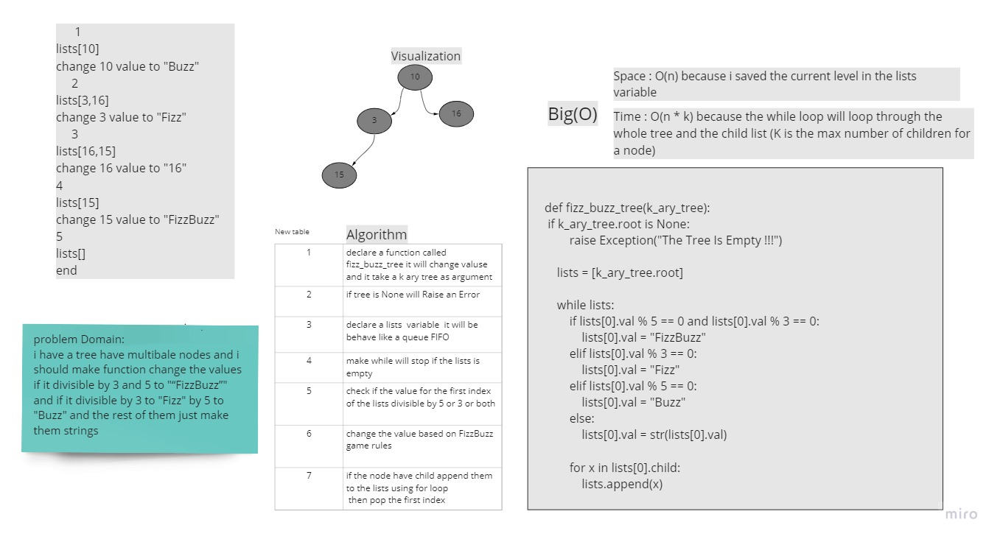

# Challenge Summary
<!-- Description of the challenge -->
Write a function called fizz buzz tree

Arguments: k-ary tree

Return: new k-ary tree


If the value is divisible by 3, replace the value with “Fizz”

If the value is divisible by 5, replace the value with “Buzz”

If the value is divisible by 3 and 5, replace the value with “FizzBuzz”

If the value is not divisible by 3 or 5, simply turn the number into a String.


## Whiteboard Process
<!-- Embedded whiteboard image -->



## Approach & Efficiency
<!-- What approach did you take? Why? What is the Big O space/time for this approach? -->

Time : O(n * k) because the while loop will loop through the whole tree and the child list (K is the max number of children for a node) 

Space : O(n) because i saved the current level  in the lists variable 

## Solution
<!-- Show how to run your code, and examples of it in action -->

```

def fizz_buzz_tree(k_ary_tree):
    if k_ary_tree.root is None:
        raise Exception("The Tree Is Empty !!!")

    lists = [k_ary_tree.root]

    while lists:
        if lists[0].val % 5 == 0 and lists[0].val % 3 == 0:
            lists[0].val = "FizzBuzz"
        elif lists[0].val % 3 == 0:
            lists[0].val = "Fizz"
        elif lists[0].val % 5 == 0:
            lists[0].val = "Buzz"
        else:
            lists[0].val = str(lists[0].val)

        for x in lists[0].child:
            lists.append(x)
        lists.pop(0)

```