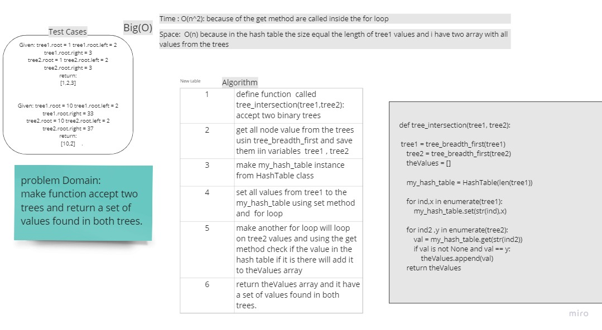

# Challenge Summary
<!-- Description of the challenge -->
make function accept two trees and return a set of values found in both trees using hash table data structure.


## Whiteboard Process
<!-- Embedded whiteboard image -->



## Approach & Efficiency
<!-- What approach did you take? Why? What is the Big O space/time for this approach? -->

What i did exactly is collecting the values from trees then but them in a hash table using set method and the keys was order to make less time complexity on the best and average case

Time : O(n): because of the get method and there is two for loop each one loop through the trees values

Space:  O(n) because in the hash table the size equal the length of tree1 values and i have two array with all values from the trees

## Solution
<!-- Show how to run your code, and examples of it in action -->

```
def tree_intersection(tree1, tree2):

    tree1 = tree_breadth_first(tree1)
    tree2 = tree_breadth_first(tree2)
    theValues = []

    my_hash_table = HashTable(len(tree1))

    for ind,x in enumerate(tree1):
        my_hash_table.set(str(ind),x)

    for ind2 ,y in enumerate(tree2):
        val = my_hash_table.get(str(ind2))
        if val is not None and val == y:
            theValues.append(val)
    return theValues

```